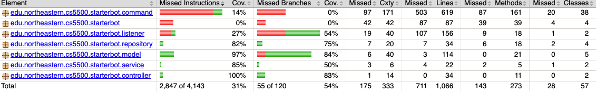
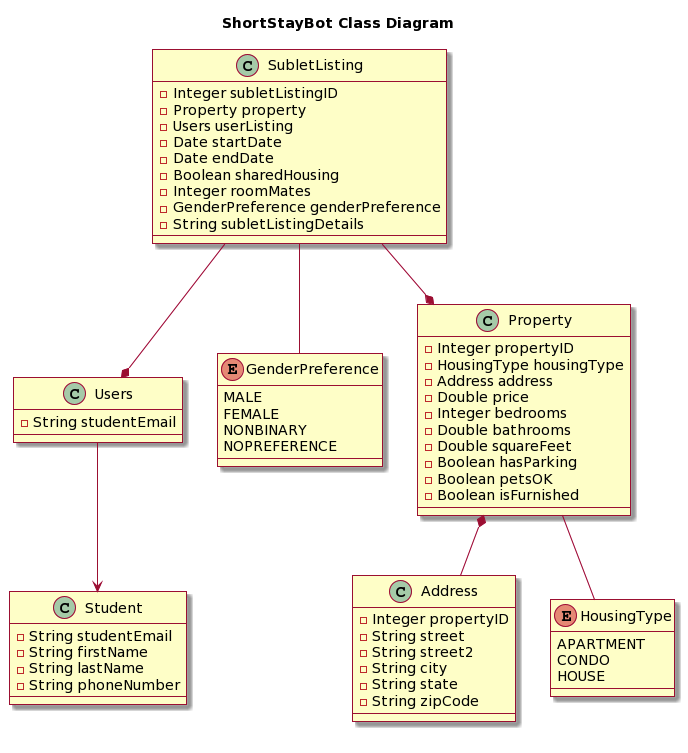
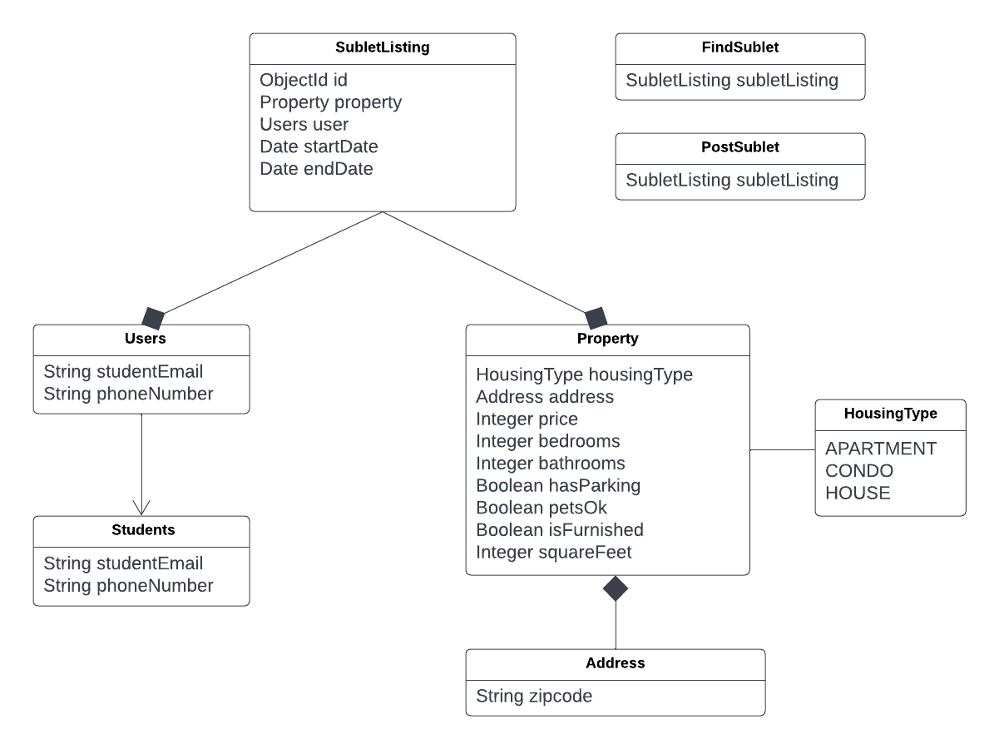
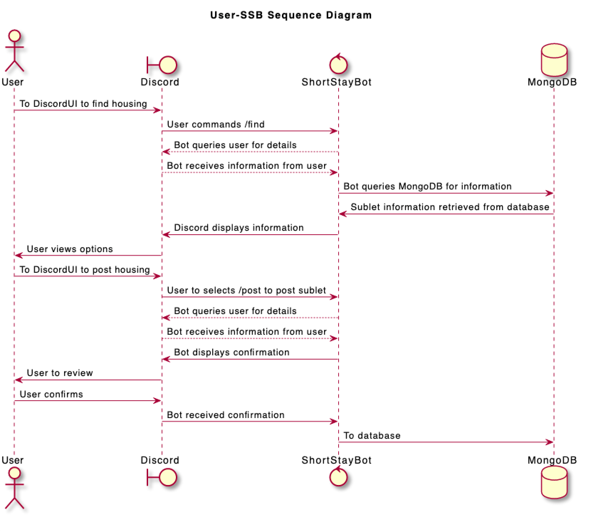
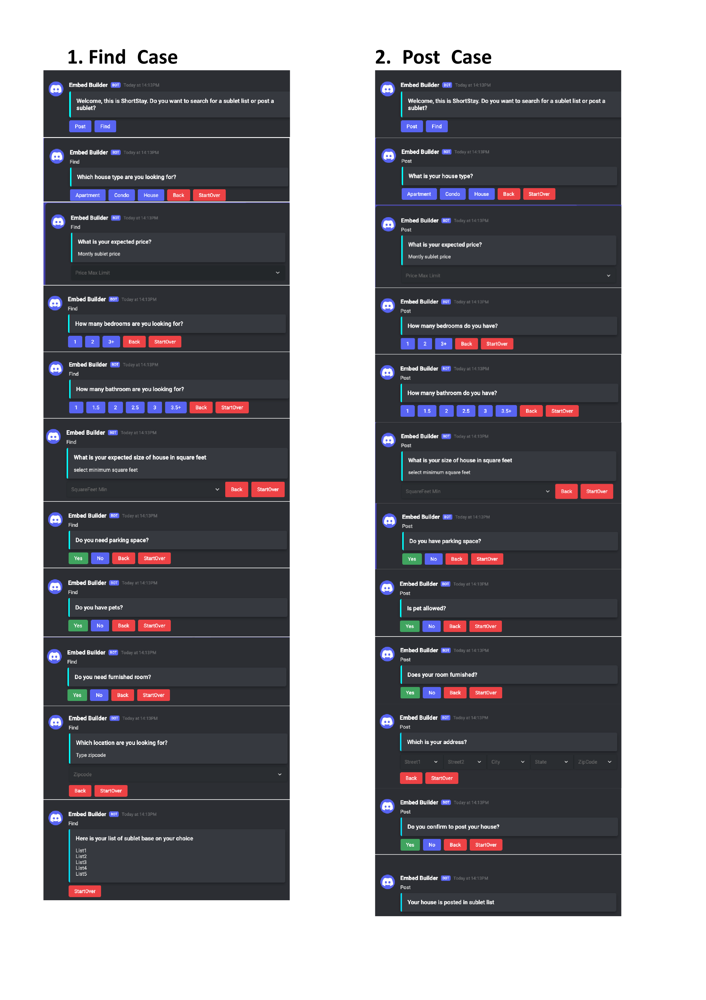
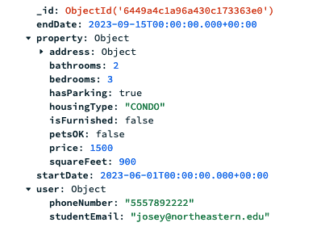
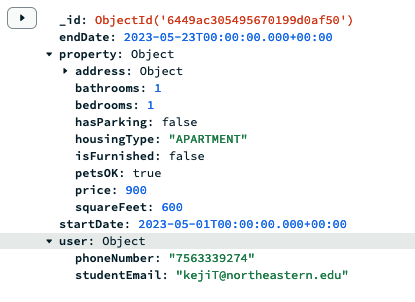
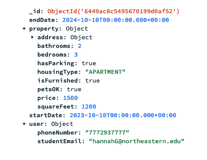

# Short Stay
https://discord.gg/Ytw2j45z

## Table of Contents

- [Links](#links)
- [Requirements](#requirements)
- [Usage](#usage)
  - [Steps](#steps)
- [Overview](#overview)
- [Goals](#goals)
- [Non-Goals](#non-goals)
- [Risks](#risks)
- [Test Coverage](#test-coverage)
- [Future Work](#future-work)
- [Design](#design)
- [Diagrams](#diagrams)
- [Final Design](#final-design)
- [Samples](#sample-data)

## Links
### Discord
- https://discord.gg/Ytw2j45z
### Requirements
- Discord account
- If deploying:
  - Bot token: BOT_TOKEN
  - MongoDB: MONGODB_URI
  - Fly.io: FLY_API_TOKEN

## Usage
####  How to use Short Stay
There are total 18 commands, but only 4 are intended for use as any commands not intended for use are to go to the next step.
Images of the intended use are at the bottom of this readme under Interface (or see TOC above for link).

#### Four commands for ShortStay functionality
- /hello -- introduction of shortstay
- /find  -- answer queries to find a sublet
- /post   -- answer queries to post a sublet
- /restart -- removes current saved post or find information so fields are not saved
  (/find and /post also restarts the process)
- /delete -- deletes sublet listing, requires posting id

#### Steps:
- 1. **Start with /hello for an introduction from the bot and instruct the user how to proceed.**
- 2. **To post: type "/post".**
  - 2.1 Select House Type
  - 2.2 Select Cost
  - 2.3 Select Number of bedrooms
  - 2.4 Select Number of bathrooms
  - 2.5 Select Size of property
  - 2.6 Select Parking space availability
  - 2.7 Select Pet availability
  - 2.8 Select Furnished option
  - 2.9 Enter Zipcode, Email, Phone, Start Date, End Date as instructed
    - Zipcode should be 5 integer values
    - Email must end in @northeastern.edu
    - Phone must be all 10 integer values
    - Start Date must be in "YYYY-MM-DD" format and cannot be before the current date
    - End Date must be in "YYYY-MM-DD" format and cannot be before start date
    - If information was incorrectly entered, read error message and start over (step 2)
  - 2.10 Sublet has been posted and it displays user's sublet information that user choose
- 3. **To find a sublet posted by another student: type "/find".**
  - 3.1 Select House Type
  - 3.2 Select Cost
  - 3.3 Select Number of bedrooms
  - 3.4 Select Number of bathrooms
  - 3.5 Select Size of property
  - 3.6 Select Parking space availability
  - 3.7 Select Pet availability
  - 3.8 Select Furnished option
  - 3.9 Enter Zipcode, Start Date, End Date
    - Zipcode must be 5 integer values
    - Start Date must be in "YYYY-MM-DD" format and cannot be before the current date
    - End Date must be in "YYYY-MM-DD" format and cannot be before start date
    - If information was incorrectly entered, read error message and start over (step 3)
  -3.10 Results: One of three /find sublet listing responses will display to the user
    - Option 1: If there is exact match with user choice, it will show the exact result that user looking for of the listing
      details and the user's contact information who posted the listing.
    - If only some of the fields match a listing (there is no exact match), the closest sublet listing will be shown by priority:
      Priority 1: (minimum for a match): zipcode, startdate(+/- 14 days before) and enddate(+/- 14 days after)
      Priority 2: Match price range (<= maximum price entered from user + 100) AND matches priority 1 requirements
      Priority 3: Matches parking, pet, and furnished boolean values AND matches priority 1 and priority 2 requirements
      Priority 4: Matches housingType AND matches priorities 1 thru 3 requirements.
    - If there is none (priority 1 requirements not met), the find sublet entered will display as well as a message to the user that none match their specs
      from there, user can start over or try again at a later date.
- 4. Restart: To restart after beginning a post or find:
  - 4.1 Option 1: If started, type "/restart" and press enter
  - 4.2 Option 2: Enter /find or /post operation without /restart
- 5. Delete: To delete a listing you posted
  - 5.1 Locate saved ID, type "/delete"
  - 5.2 Enter ID, confirm
  - 5.3 Receive success message or eror message

## Overview
Internship and Co-op experiences are a key component of many degree programs offered at Northeastern University (NEU), but may require relocation for a length of time shorter than that of a typical 12-month lease. Sublets are an affordable solution to these situations, but they can be difficult to find in an unfamiliar city and some listings can be fraudulent. The goal of Short Stay is to connect students at NEU who are looking to sublet their housing with other students looking to rent housing for a limited period of time. The user will be able to find affordable, safe housing from other students who may be experiencing a similar relocation situation.

## Goals
- Allow a user with a northeastern.edu email account to post their housing to sublet
- Allow users to search for housing that meets their needs
  - Dates available, zipcode, price, housing type, bedrooms, bathrooms, parking, pet allowance, furnished, etc.
- Allow user to see contact information from sublet listing to contact them
- Allow a user to restart if they would like to change fields when posting or finding
- Allow a user to delete a posting if they found someone to sublet their post to

## Non-Goals
- Direct messaging between the user and the student listing the housing
- Expressing interest directly through the application
- Update fields individually without restarting
- Use a personal email to post a listing
- Listing/searching housing for purchase
- Not for finding short-term lease housing
- User can not see the information of student who listed sublet or the entire address (safety), only student email and phone

## Risks
### Where is the data stored?
This project relies on an understanding of MongoDB to add data, query data, and view data in an efficient, clear manner. The development team has limited experience with databases,
and have not worked with MongoDB.
**Mitigation:** Use skills from other database knowledge, can manually filter via java instead of MongoDB queries, and can use many online resources since it is a popular service
### Legal risks
No one on the team is familiar with real estate or potential legal risks related to topics of this nature.

**Mitigation:** This is a student project and therefore unlikely to be used by anyone in a way that will attract legal attention.
                Some notes should still be made about potential issues when they come up (e.g. housing discrimination laws).
### Lack of existing data
There might be not much data information about the sublet(API), need to find data individually.
**Mitigation:** Add priorities when filtering subletlisting in /find so that users can find the closest possible match.
                Also, this is a student project and would not be expected to return real listings, so dummy data can be entered.
### User identity and safety
How do we prove that a user is actually a Northeastern student? How much information provides the posting student security?

**Mitigation:** For the purposes of this student project, we can prevent users from entering any email not ".northeastern.edu".
                Attempts to use duplicate email addresses should probably be blocked.
                For safety, only display student's provided contact information and hide any detailed address information, as the poster
                can provide as much information as they would like once they are contacted.

## Test Coverage
**NOTE ABOUT COVERAGE**
It was our team's intention to fully test our code to at least 40%, but to aim for 50-60%. However,
much of our code's functionality involved immediately calling commands sequentially and then storing the information.
For example, for find:
/find --> findhousetype --> findprice --> findnumbedrooms --> findnumbathrooms ... --> findzipcode --> information to MessageListener
Each step in this process requires an @Nonnul  <-TYPE->InteractionEvent and will handle the previous input. In order to fully test this,
some sort of mock event requiring Mockito would be a requirement. As instructed, we avoided mockito because it would not be able to accurately test
the functionality of these commands. Thus, we tested as much as possible and created a MessageListenerMethods class that allowed us to test
the functions being used by MessageListener. We also used Singletons to save information from a command so we could test the model to mimic what we were
doing in the commands. Even with such changes, we were unable to meet our test coverage goal. We tested the name/commanddata functions in each class and
tested as close to 100% for all testable classes.

To view all: [Test Coverage Complete](documents/TestCoverageComplete)

## Incomplete / Struggles
- Testing: Please see above for note on testing.
- Pivot: Our initial project proposal was to create a bot that could interact with a user similar to a Zillow application to retrieve properties for
  sale, lease, sublet, etc. However, the API we were intending to use would have required more endpoints than the free version would allow and we were
  unable to find an acceptable alternative, Thus, about halfway through the course we implemented a simpler application that would allow
  students to post and find short-term housing. This allowed us to create our own data rather than trying to utilize expensive real estate data. This
  pivot introduced challenges and we needed to put in additional effort to produce a final version by the deadline.
- Communication: In order to be able to complete the project on time we needed to communicate as a team nearly every day using a Teams daily standup thread.
- Starting: Learning how to use the JDA api and starter code effectively and efficiently was difficult, we were unable to use our intended simple class diagram since
  storing/retrieving information with each command step was more complicated that initially suspected.
- Database: It took us a while to setup MongoDB and understand how to use it efficiently as none of us had used this service before, luckily we were
  able to communicate and get everything working.
- Functionality: After the pivot, we were planning to allow the user to move backwards a step for /find or /post, allow a user to /update a listing
  and potentially allow a user to easily delete/view their listings by their email address. Given time constraints, we settled on the commands we implemented
  and require the user to keep their listing id.

## Future Work
- Allow the user to easily see the postings they have listed.
- Allow the user to see multiple matches or even view all the available options.
- Add more confirm/cancel options with each step.
- Improve the extendability of the code by adding additional classes that handle some of the functionality outside of the command classes.
- Add a parsing class, embed class that has accessible embeds/actions frequently used by different commands.
- After improving the extendability and moving logic to different classes, we would prioritize improving the testing of our code.
- Add authorization (firebase authentication would be an option to have a user confirm their email account).
- Perform additional user studies to edit the design and functionality of the code to be appealing to our intended audience.
## Diagrams
### Draft Class Diagram

### Final Class Diagram

### Sequence Diagram

### Draft Design

## Final Design
/FinalDesignInterface-1-1.png)
/FinalDesignInterface-1-2.png)
/FinalDesignInterface-1-3.png)
/FinalDesignInterface-1-4.png)
/FinalDesignInterface-1-5.png)
/FinalDesignInterface-1-6.png)

## Sample Data
Feel free to use these examples to test the functionality, these are subletlistings in the database.
Please do not delete unless you are the grader.

